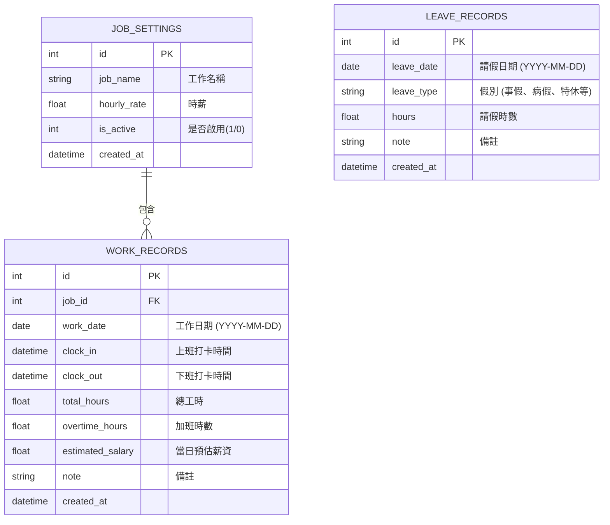

# 資料庫設計文件 (DB Design)

## 1. ER 圖（實體關係圖）

## 2. 資料表詳細說明

### 2.1 JOB_SETTINGS (工作設定)
負責儲存使用者的時薪設定。為了支援未來多份工作，拆分成獨立的表。
- `id` (INTEGER): 主鍵，自動遞增。
- `job_name` (TEXT): 必填，工作名稱（如：白天超商、晚上家教）。
- `hourly_rate` (REAL): 必填，基本時薪。
- `is_active` (INTEGER): 預設 1。標記是否為目前主要工作。
- `created_at` (DATETIME): 建立時間。

### 2.2 WORK_RECORDS (工時紀錄)
負責儲存每日的打卡資料與結算結果。
- `id` (INTEGER): 主鍵，自動遞增。
- `job_id` (INTEGER): 外鍵，關聯到 `JOB_SETTINGS`，標示這筆紀錄屬於哪份工作。
- `work_date` (DATE): 必填，工作日期，格式為 YYYY-MM-DD。
- `clock_in` (DATETIME): 上班打卡時間 (ISO 格式或 NULL)。
- `clock_out` (DATETIME): 下班打卡時間 (ISO 格式或 NULL)。
- `total_hours` (REAL): 結算總工時。
- `overtime_hours` (REAL): 結算加班時數。
- `estimated_salary` (REAL): 結算當日預估薪水。
- `note` (TEXT): 供使用者寫日記或備註。
- `created_at` (DATETIME): 紀錄建立時間。

### 2.3 LEAVE_RECORDS (請假紀錄)
獨立的表儲存請假，方便計算月薪時扣除。
- `id` (INTEGER): 主鍵，自動遞增。
- `leave_date` (DATE): 必填，請假日期，格式為 YYYY-MM-DD。
- `leave_type` (TEXT): 必填，如 sick(病假), personal(事假), pto(特休)。
- `hours` (REAL): 必填，請假時數 (如 4 小時半天、8 小時全天)。
- `note` (TEXT): 請假事由。
- `created_at` (DATETIME): 紀錄建立時間。
