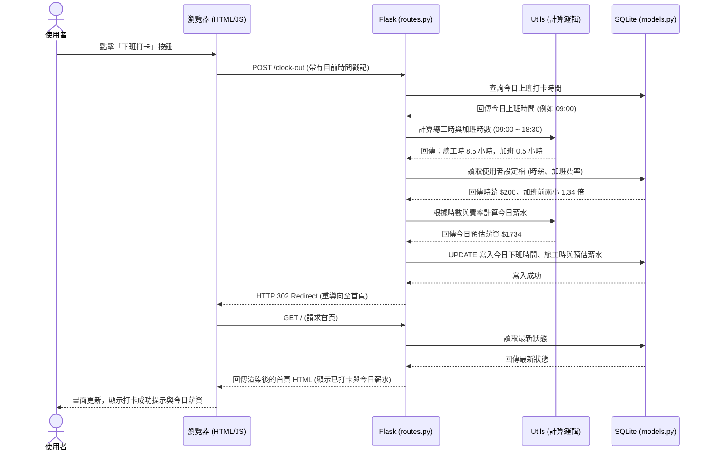

# 紀錄上班時數小程式 - 系統流程圖

這份文件描述了使用者在系統內的操作路徑 (User Flow)，以及系統背後處理資料的順序 (Sequence Diagram)。

## 1. 使用者流程圖 (User Flow)

描述使用者從開啟網頁開始，可能會經歷的操作流程。

```mermaid
flowchart TD
    Start([使用者開啟網頁]) --> Home[首頁 (今日狀態)]
    
    Home --> Action1{選擇操作}
    
    Action1 -->|每日打卡| ClockIn[點擊上班/下班打卡]
    ClockIn -->|系統自動計算工時| Home
    
    Action1 -->|手動補登| ManualEntry[手動新增/編輯工時表單]
    ManualEntry -->|填寫日期與時間| SaveRecord[儲存紀錄]
    SaveRecord --> Home
    
    Action1 -->|查看報表| NavCalendar[切換至月曆視圖]
    NavCalendar --> ViewMonth[查看當月總工時與預估薪水]
    ViewMonth --> Export[點擊匯出 PDF/Excel]
    
    Action1 -->|系統設定| NavSettings[切換至設定頁面]
    NavSettings --> JobSetting[設定基本時薪 / 加班費率 / 假別規則]
    JobSetting --> SaveSetting[儲存設定]
    SaveSetting --> Home
```

## 2. 系統序列圖 (Sequence Diagram)

以「**使用者每日下班打卡並計算今日薪水**」這個核心功能為例，展示系統內部元件如何互動。



## 3. 功能清單與路由對照表

初步規劃系統需要的 URL 路徑與對應的操作。

| 功能描述 | HTTP 方法 | URL 路徑 | 對應 View / 行為 |
| :--- | :--- | :--- | :--- |
| **首頁/打卡面板** | `GET` | `/` | `index.html` (顯示今日狀態) |
| **上班打卡** | `POST` | `/clock-in` | 寫入上班時間，重導向至 `/` |
| **下班打卡** | `POST` | `/clock-out` | 寫入下班時間與計算時數，重導向至 `/` |
| **手動新增紀錄** | `POST` | `/record/add` | 接收表單資料，寫入資料庫 |
| **編輯/請假紀錄** | `POST` | `/record/edit/<id>` | 更新特定日期的紀錄或標記請假 |
| **刪除紀錄** | `POST` | `/record/delete/<id>`| 刪除紀錄 |
| **月曆視圖** | `GET` | `/calendar` | `calendar.html` (顯示月曆與統計) |
| **匯出當月報表** | `GET` | `/export/<year>/<month>`| 產生並下載 PDF/CSV 檔案 |
| **系統設定頁面** | `GET` | `/settings` | `settings.html` (顯示目前設定) |
| **更新設定** | `POST` | `/settings` | 更新時薪、加班費率等設定，重導向至 `/settings` |
