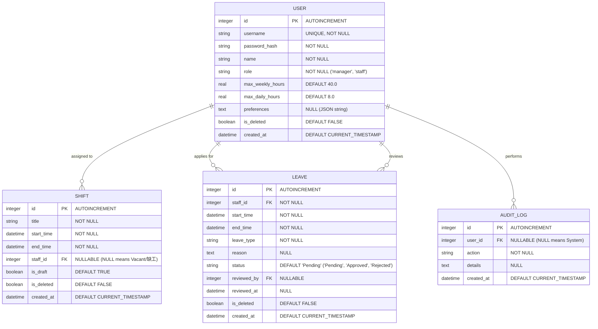

# 自動打工排班最佳化系統 — 資料庫設計模板 (DATABASE_DESIGN)

本模板依據產品需求模板（PRD）、系統架構設計模板與流程圖設計，定義本系統之 SQLite 資料庫結構。包含 **Entity Relationship Diagram (ERD)**、各資料表詳細欄位說明、SQLite DDL 語法，以及 Python SQLAlchemy Model 的設計規範。

---

## 1. 實體關係圖 (ERD)

本系統的核心實體包含**使用者/員工（User）**、**班表記錄（Shift）**、**請假申請（Leave）**與**操作日誌（AuditLog）**。以下為實體關係 Mermaid 圖：



---

## 2. 資料表詳細說明

### 2.1 使用者/員工資料表 (users)
記錄所有系統使用者（店長與員工）的基本資料、帳戶安全密碼與其排班限制與可用偏好。

| 欄位名稱 (Snake Case) | 資料型別 (SQLite) | 屬性 (Attributes) | 說明 |
| :--- | :--- | :---: | :--- |
| `id` | INTEGER | PK, AUTOINCREMENT | 使用者唯一識別碼 |
| `username` | TEXT | UNIQUE, NOT NULL | 登入帳號（如員工編號或電子郵件） |
| `password_hash` | TEXT | NOT NULL | 經 bcrypt 加密後的密碼雜湊值 |
| `name` | TEXT | NOT NULL | 員工真實姓名 |
| `role` | TEXT | NOT NULL | 系統角色：`'manager'`（店長/管理員）或 `'staff'`（一般員工） |
| `max_weekly_hours` | REAL | NOT NULL, DEFAULT 40.0 | 每週工時上限，自動排班與合規檢核依據 |
| `max_daily_hours` | REAL | NOT NULL, DEFAULT 8.0 | 單日工時上限，自動排班與合規檢核依據 |
| `preferences` | TEXT | NULL | 員工排班偏好，儲存為 JSON 字串。例如：`{"unavailable_days": [0, 6], "preferred_shifts": ["早班"]}` |
| `is_deleted` | BOOLEAN | NOT NULL, DEFAULT FALSE | 軟刪除註記 (True 代表已離職/刪除) |
| `created_at` | DATETIME | NOT NULL, DEFAULT CURRENT_TIMESTAMP | 帳戶建立時間 |

### 2.2 班表記錄表 (shifts)
記錄店長安排的每一筆工作班次。當 `staff_id` 為 NULL 時，代表此班次目前無人出勤，屬於**缺工狀態**。

| 欄位名稱 (Snake Case) | 資料型別 (SQLite) | 屬性 (Attributes) | 說明 |
| :--- | :--- | :---: | :--- |
| `id` | INTEGER | PK, AUTOINCREMENT | 班表唯一識別碼 |
| `title` | TEXT | NOT NULL | 班別名稱（例如：'早班'、'中班'、'晚班'） |
| `start_time` | DATETIME | NOT NULL | 班次開始日期與時間 (YYYY-MM-DD HH:MM:SS) |
| `end_time` | DATETIME | NOT NULL | 班次結束日期與時間 (YYYY-MM-DD HH:MM:SS) |
| `staff_id` | INTEGER | FK (users.id), NULLABLE | 指派的員工 ID。為空代表目前為空班/缺工 |
| `is_draft` | BOOLEAN | NOT NULL, DEFAULT TRUE | 是否為排班草稿 (True 僅店長可見，False 代表已正式發佈) |
| `is_deleted` | BOOLEAN | NOT NULL, DEFAULT FALSE | 軟刪除註記 |
| `created_at` | DATETIME | NOT NULL, DEFAULT CURRENT_TIMESTAMP | 班次建立時間 |

### 2.3 請假申請表 (leaves)
記錄一般員工的請假單。審核通過（Approved）後，系統排班邏輯會自動將該員工在該時段的班表排除。

| 欄位名稱 (Snake Case) | 資料型別 (SQLite) | 屬性 (Attributes) | 說明 |
| :--- | :--- | :---: | :--- |
| `id` | INTEGER | PK, AUTOINCREMENT | 請假單唯一識別碼 |
| `staff_id` | INTEGER | FK (users.id), NOT NULL | 提出請假申請的員工 ID |
| `start_time` | DATETIME | NOT NULL | 請假開始時間 |
| `end_time` | DATETIME | NOT NULL | 請假結束時間 |
| `leave_type` | TEXT | NOT NULL | 請假種類：`'Vacation'`(特休), `'Sick'`(病假), `'Personal'`(事假) 等 |
| `reason` | TEXT | NULL | 請假具體事由 |
| `status` | TEXT | NOT NULL, DEFAULT 'Pending'| 審核狀態：`'Pending'`(待審), `'Approved'`(已核准), `'Rejected'`(已拒絕) |
| `reviewed_by` | INTEGER | FK (users.id), NULL | 審核此假單的店長 ID |
| `reviewed_at` | DATETIME | NULL | 店長審核時間 |
| `is_deleted` | BOOLEAN | NOT NULL, DEFAULT FALSE | 軟刪除註記 |
| `created_at` | DATETIME | NOT NULL, DEFAULT CURRENT_TIMESTAMP | 請假單送出時間 |

### 2.4 操作日誌表 (audit_logs)
保存系統關鍵操作日誌，用以事後稽核與爭議釐清。

| 欄位名稱 (Snake Case) | 資料型別 (SQLite) | 屬性 (Attributes) | 說明 |
| :--- | :--- | :---: | :--- |
| `id` | INTEGER | PK, AUTOINCREMENT | 日誌唯一識別碼 |
| `user_id` | INTEGER | FK (users.id), NULLABLE | 執行此操作的使用者 ID (NULL 代表系統自動執行) |
| `action` | TEXT | NOT NULL | 關鍵動作（如：'AUTO_SCHEDULE', 'PUBLISH_CALENDAR', 'APPROVE_LEAVE'） |
| `details` | TEXT | NULL | 詳細異動內容 JSON，便於稽核 (例如紀錄修改了哪些班表) |
| `created_at` | DATETIME | NOT NULL, DEFAULT CURRENT_TIMESTAMP | 紀錄寫入時間 |

---

## 3. SQL 建表語法

請參考儲存於 [database/schema.sql](file:///c:/Users/yaoz5/程式/模板/Work-scheduling-system/實作/database/schema.sql) 的 DDL 語法。

```sql
-- 啟用外鍵約束
PRAGMA foreign_keys = ON;

-- 1. 建立使用者資料表
CREATE TABLE IF NOT EXISTS users (
    id INTEGER PRIMARY KEY AUTOINCREMENT,
    username TEXT UNIQUE NOT NULL,
    password_hash TEXT NOT NULL,
    name TEXT NOT NULL,
    role TEXT NOT NULL CHECK(role IN ('manager', 'staff')),
    max_weekly_hours REAL NOT NULL DEFAULT 40.0,
    max_daily_hours REAL NOT NULL DEFAULT 8.0,
    preferences TEXT,
    is_deleted BOOLEAN NOT NULL DEFAULT 0,
    created_at DATETIME NOT NULL DEFAULT CURRENT_TIMESTAMP
);

-- 2. 建立班表記錄表
CREATE TABLE IF NOT EXISTS shifts (
    id INTEGER PRIMARY KEY AUTOINCREMENT,
    title TEXT NOT NULL,
    start_time DATETIME NOT NULL,
    end_time DATETIME NOT NULL,
    staff_id INTEGER,
    is_draft BOOLEAN NOT NULL DEFAULT 1,
    is_deleted BOOLEAN NOT NULL DEFAULT 0,
    created_at DATETIME NOT NULL DEFAULT CURRENT_TIMESTAMP,
    FOREIGN KEY (staff_id) REFERENCES users(id) ON DELETE SET NULL
);

-- 3. 建立請假申請表
CREATE TABLE IF NOT EXISTS leaves (
    id INTEGER PRIMARY KEY AUTOINCREMENT,
    staff_id INTEGER NOT NULL,
    start_time DATETIME NOT NULL,
    end_time DATETIME NOT NULL,
    leave_type TEXT NOT NULL,
    reason TEXT,
    status TEXT NOT NULL DEFAULT 'Pending' CHECK(status IN ('Pending', 'Approved', 'Rejected')),
    reviewed_by INTEGER,
    reviewed_at DATETIME,
    is_deleted BOOLEAN NOT NULL DEFAULT 0,
    created_at DATETIME NOT NULL DEFAULT CURRENT_TIMESTAMP,
    FOREIGN KEY (staff_id) REFERENCES users(id) ON DELETE CASCADE,
    FOREIGN KEY (reviewed_by) REFERENCES users(id) ON DELETE SET NULL
);

-- 4. 建立操作日誌表
CREATE TABLE IF NOT EXISTS audit_logs (
    id INTEGER PRIMARY KEY AUTOINCREMENT,
    user_id INTEGER,
    action TEXT NOT NULL,
    details TEXT,
    created_at DATETIME NOT NULL DEFAULT CURRENT_TIMESTAMP,
    FOREIGN KEY (user_id) REFERENCES users(id) ON DELETE SET NULL
);

-- 建立索引加速查詢
CREATE INDEX IF NOT EXISTS idx_shifts_time ON shifts(start_time, end_time);
CREATE INDEX IF NOT EXISTS idx_shifts_staff ON shifts(staff_id);
CREATE INDEX IF NOT EXISTS idx_leaves_staff ON leaves(staff_id);
```

---

## 4. Python SQLAlchemy Model 程式碼規範

所有 Model 設計皆使用 Flask-SQLAlchemy 實作，並定義於 `實作/app/models/` 目錄中：
- 每個 Model 封裝了基礎與特製化的 **CRUD** 方法與規則檢核。
- 當發生工時檢索或資料修改時，將直接呼叫各 Model 內建的業務邏輯方法。
- [app/models/user.py](file:///c:/Users/yaoz5/程式/模板/Work-scheduling-system/實作/app/models/user.py) 負責帳號、密碼 bcrypt 雜湊與可用偏好解析。
- [app/models/shift.py](file:///c:/Users/yaoz5/程式/模板/Work-scheduling-system/實作/app/models/shift.py) 負責班表增刪改查，並具備工時上限和缺工警告。
- [app/models/leave.py](file:///c:/Users/yaoz5/程式/模板/Work-scheduling-system/實作/app/models/leave.py) 負責請假審查與狀態流轉。

詳細程式碼已產生並儲存於 [實作/app/models/](file:///c:/Users/yaoz5/程式/模板/Work-scheduling-system/實作/app/models/) 中。

---

*模板版本：v1.0*  
*最後更新日期：2026-06-02*
