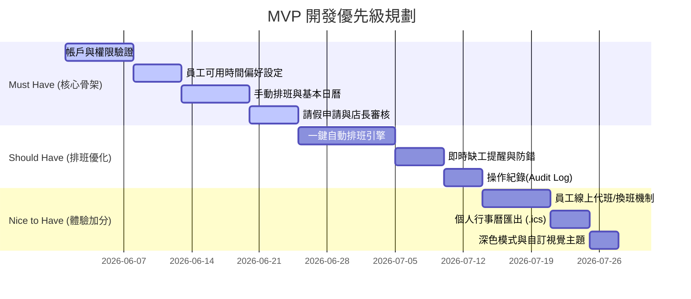

# 自動打工排班最佳化系統 — 產品需求模板 (PRD)

本模板旨在定義「自動打工排班最佳化系統」的產品功能範圍、非功能性需求與 MVP（最小可行性產品）劃分，作為開發團隊進行系統架構設計與程式實作的基準依據。

---

## 1. 專案概述

### 背景與動機
在零售、餐飲、服務業等大量使用打工/兼職人員的商家中，排班一直是一項極具挑戰且耗時的工作。店長或管理人員每週/每月都需要面對多重變因：每位員工的可用時間不同、法規工時限制、員工臨時請假、以及店內在不同時段的平假日人力需求差異。

傳統上使用 Excel 或紙本排班，不僅耗費店長數小時甚至數天的時間，還容易發生排班衝突、遺漏請假申請或人力分配不均（缺工或人員過剩）的問題。

本系統旨在打造一個**自動打工排班最佳化系統**，透過演算法與人性化的介面，整合**自動排班、請假管理、缺工警示**三大核心支柱，協助商家以最短時間排定最符合效益的班表，降低營運成本並提升員工滿意度。

### 目標用戶
1. **商家管理人員（店長、排班經理）**：負責管理員工名單、設定營運人力需求、審核請假/代班、執行自動排班、以及最終確認並發佈班表。
2. **打工與兼職員工**：負責填寫個人偏好工作時間、提交請假或代班申請、以及檢視個人與團隊班表。

### 核心價值主張
- **省時高效**：一鍵自動化排班，將數小時的排班時間縮短至數分鐘。
- **靈活彈性**：無縫整合請假與代班，動態調度人力。
- **營運防錯**：智慧化缺工警示與合規檢核，確保每日營業時段人力充足且符合法規。
- **資訊透明**：視覺化行事曆，讓管理人員與員工隨時隨地掌握最新班表資訊。

---

## 2. 功能需求

系統主要功能區分為以下五大板塊。每項功能皆附帶對應的使用者故事（User Stories）以釐清開發範疇：

### 2.1 員工帳戶與偏好管理 (Employee & Preference Management)
- **描述**：管理員工基本資料、身分（管理員/員工）、可用時間（Availability）與工時上限設定。
- **使用者故事**：
  - 作為**商家店長**，我希望能在系統中新增、編輯與停用員工資料，以便於維護店內的人力名冊。
  - 作為**商家店長**，我希望為每位兼職員工設定「每週最大工時上限」與「單日最長工時限制」，以便於遵守勞基法與控制人力成本。
  - 作為**打工人員**，我希望能在系統中設定「偏好工作時段」與「不可工作時段」，以便於排班系統在自動排班時能考慮我的個人生活與學業安排。

### 2.2 營運人力需求與班表設定 (Operational Demand & Shift Definition)
- **描述**：設定每日不同時段（如早班、中班、晚班）的最低人力需求人數，並可區分平日與假日。
- **使用者故事**：
  - 作為**商家店長**，我希望能夠自由定義店內的「班別種類」（例如：早班 08:00-16:00 需要 3 人，晚班 16:00-24:00 需要 4 人），以便建立每日人力基準。
  - 作為**商家店長**，我希望可以針對「特定日期」（如特定節日、週年慶）調高人力需求人數，以應對預期的客流量高峰。

### 2.3 智慧自動排班引擎 (Intelligent Auto-Scheduling Engine)
- **描述**：一鍵觸發自動排班演算，在滿足人力需求、避開員工不可工作時段、不超出工時上限及優先考慮員工偏好時段的前提下，產出最佳化班表。
- **潛在風險與局限性**：自動排班系統過於理想化，且邏輯極其複雜，可能因極端限制條件導致無法達到預期排班需求，甚至產生不合理的排班結果（如人力過度集中、違反特定人員偏好）。
- **應對方案**：
  - **方案一（手動微調機制）**：系統先進行自動排班產生草稿，隨後提供店長在視覺化行事曆上進行人為手動修改與微調。
  - **方案二（漸進式優化）**：每月重新輸入或更新員工的可排班資料，讓系統根據前一個月的實際出勤與回饋數據，逐步調整演算法參數以優化排班結果，提升排班合理性。
- **使用者故事**：
  - 作為**商家店長**，我希望能夠一鍵點擊「自動排班」，讓系統自動在數秒內生成下週/下月的班表草稿，以便省去繁瑣的手動編排。
  - 作為**商家店長**，我希望在自動排班產出草稿後，仍可手動進行「拖拉微調」或替換人員，以便靈活應對各種突發性的人事調動並修正不合理排班。

### 2.4 請假與代班協調整合 (Leave & Shift Swap Integration)
- **描述**：線上請假申請與審核機制，並可針對已排定的班別發起代班/換班申請。
- **潛在風險與局限性**：請假系統本身邏輯較簡單，易於實現，但在實際運行中可能面臨請假訊息傳遞延遲或無法即時送達主管與現場人員的問題。
- **應對方案**：
  - **即時更新機制**：請假經審核後，系統須即時更新班表資料庫並重新渲染前端行事曆，確保資訊零時差。
  - **基本輸入防錯檢查**：在請假與代班申請表單中加入嚴格的輸入檢查（如防重複請假、防止過去時間請假、防止無效日期等），避免錯誤數據產生。
  - **現場變更機制**：系統支援現場主管或授權人員直接手動更改當日班表，以應對突發性的現場請假。
- **使用者故事**：
  - 作為**打工人員**，我希望可以在系統中直接提出「請假申請」，以便讓店長審核，並讓系統在排班時自動避開該請假時段。
  - 作為**打工人員**，若臨時有事無法出勤，我希望可以針對自己已排定的班別發起「代班募集」，讓其他有空擋的同事能線上接單替補，以便簡化私下找人代班的溝通成本。
  - 作為**商家店長**，我希望能在後台一目瞭然地審核員工的請假與代班申請，以確保調度過程透明且受控。

### 2.5 智慧缺工警示與視覺化看板 (Understaffing Alert & Visualization)
- **描述**：即時分析班表覆蓋率，當有時段人力未達標準、或有員工請假造成空班時，系統自動發出紅字或提示警示。
- **潛在風險與局限性**：缺工提醒功能雖然單一且風險較低，但可能因手機型號不同、瀏覽器背景執行限制或網路波動等因素，導致系統通知出現延遲或無法正常通知的情況。
- **應對方案**：
  - **反覆相容性測試**：針對不同手機瀏覽器及作業系統進行嚴格的多輪測試，取得最佳的瀏覽器通知或系統內通知效果。
  - **整合 LINE 提醒功能**：引入 LINE Notify 或 LINE Bot 串接，當發生臨時請假或缺工時，除了系統內部提示，另外即時發送 LINE 訊息通知主管或相關員工，以確保通知的觸達率與即時性。
- **使用者故事**：
  - 作為**商家店長**，我希望能在行事曆上看見「缺工紅色警示標籤」（例如：週五晚班尚缺 1 人），以便我能立即發現並手動補人或發佈代班需求。
  - 作為**商家店長與打工人員**，我希望擁有直觀的「行事曆視覺化介面」，並能切換月視角、週視角與個人視角，以便用最輕鬆的視覺方式掌握班表全貌。

---

## 3. 非功能需求

為了確保系統能在實際商家運作中穩定且流暢地使用，以下非功能性需求必須納入設計考量：

### 3.1 技術限制與架構
- **核心框架**：本專案採用 **Flask** 作為後端 Web 框架。
- **前端模板**：採用 **Jinja2 模板引擎** 進行伺服器端渲染（SSR），並使用 Vanilla CSS 與 JavaScript 提供豐富的微互動與動態排班視覺化效果。
- **資料庫**：使用 **SQLite** 作為關聯式資料庫，確保輕量、易於部署且具備良好的事務一致性（ACID）。

### 3.2 效能與即時通知效能
- **排班運算效率**：自動排班引擎（不論是基於貪婪演算法、啟發式演算法或規劃求解器）在處理 30 人以內、為期一個月的排班時，運算時間必須控制在 **5 秒**以內，避免使用者介面卡死。排班時應採用非同步或前端載入動畫（Skeleton/Loader）提升使用者體驗。
- **即時通知與反應**：
  - 當請假被核准、或是班表發佈時，系統內部通知應能即時（1 秒內）寫入資料庫並在前端更新。
  - **LINE 提醒功能**：系統應提供 LINE 通知管道（如 LINE Notify API 整合），以應對因行動設備差異導致的網頁推送失敗。當發生主管審核假單、緊急缺工或代班募集時，應能同步推播至設定的 LINE 聊天室或群組。
  - **通知可靠性測試**：在開發過程中，須特別針對通知發送的成功率、延遲時間與多種手機平台進行極限與相容性測試，確保通知送達率。

### 3.3 身分驗證與操作紀錄
- **身分驗證（Authentication & Authorization）**：
  - 系統必須提供安全的密碼雜湊儲存（如 bcrypt 或 werkzeug.security）。
  - 角色嚴格劃分為**管理員（Manager/Admin）**與**一般員工（Staff）**，利用 Flask Session 機制實施權限控管，防止員工越權查看他人薪資偏好或修改班表。
- **操作紀錄（Audit Log / Activity Log）**：
  - 系統需記錄關鍵操作（如：班表發佈、請假審核、手動修改班表、自動排班執行紀錄），以便發生排班爭議時有跡可循。

### 3.4 使用者介面直觀與視覺化資訊
- **響應式網頁設計 (RWD)**：店長多半在桌機/平板上進行複雜排班，而員工則幾乎全在手機上查看班表與請假。因此，系統介面必須對行動裝置極致親和。
- **視覺化資訊**：
  - 班表採用互動式行事曆元件（如整合 FullCalendar.js 或自研 CSS Grid 日曆）。
  - 缺工、請假待審核、工時超標等狀態需使用和諧且具備高識別度的色彩系統（例如：紅色代表缺工警告、橘色代表請假待審、綠色代表班表已確認）。

---

## 4. MVP 範圍 (Minimum Viable Product)

為了確保專案能穩健推進，我們將功能依照重要程度劃分為三個層級，確保核心骨架（Must Have）能最早交付並驗證。

### 4.1 Must Have (必須擁有 - 第一階段交付)
*這部分是系統運作的基本前提，沒有這些功能系統將無法運作。*
1. **身分驗證系統**：管理員與員工註冊、登入、登出及基本權限隔離。
2. **員工基本資料與偏好設定**：員工能自主在週曆上勾選「不可上班時間」。
3. **基礎排班管理與視覺化**：店長能在 Web 介面上手動新增/編輯/刪除班表，且員工能查閱自己的班表。
4. **基本請假管理**：員工發起請假申請（日期、假別、備註），店長可進行核准或拒絕，且請假成功後，店長手動排班介面應將該員工標示為不可選用。

### 4.2 Should Have (應該擁有 - 第二階段交付)
*大幅提升系統核心價值與效率的功能。*
1. **一鍵自動排班引擎**：輸入人力需求後，系統能根據員工不可上班時間、工時限制，自動排定出最佳班表草稿。
2. **即時缺工與合規警示**：若店長手動排班或請假審核導致某時段無人上班，或使員工連續工作超過勞基法限制，行事曆應即時彈出紅色高亮警示。
3. **操作紀錄功能**：後台提供操作日誌，記錄誰在什麼時間點修改了班表或審核了假單。

### 4.3 Nice to Have (可以擁有 - 願景與加分項)
*能顯著提升使用者體驗與便利性，但非核心運作必需的功能。*
1. **員工代班/換班媒合平台**：員工發起代班申請，同職能的同事收到通知後可一鍵接單，店長最終確認即可完成換班。
2. **個人行事曆訂閱/匯出**：支援產出 iCalendar (.ics) 連結，讓員工將排班表無縫同步至 Google Calendar 或 Apple Calendar。
3. **深色模式與自訂視覺主題**：配合商家的品牌色彩調整系統主題。

---

## 5. 專案成員與分工

本專案由開發團隊協作完成，以下為分工表（可依團隊狀況隨時更新）：

| 姓名 / 角色 | 主要負責模組與職掌 | 預計交付產出 | 備註 |
| :--- | :--- | :--- | :--- |
| **成員 A (PM / Backend)** | 專案規劃、Flask 核心路由設計、資料庫 Schema 定義、請假審核邏輯實作。 | `db-design`, `api-design`, `models.py` | |
| **成員 B (Algorithm / Backend)** | 自動排班引擎演算法實作、工時防錯與合規性驗證、操作日誌模組。 | `scheduler.py`, `rules.py` | |
| **成員 C (Frontend / UI)** | Jinja2 模板視覺化設計、CSS Grid/Flexbox 互動式行事曆實作、響應式（RWD）優化。 | `templates/`, `static/css/`, `static/js/` | |
| **成員 D (QA / DevOps)** | 系統測試案例撰寫、自動化測試（Unit Test）、SQLite 資料庫初始化與部署驗證。 | `tests/`, `seed.py`, `walkthrough.md` | |

---

*模板版本：v1.0*  
*最後更新日期：2026-06-01*
