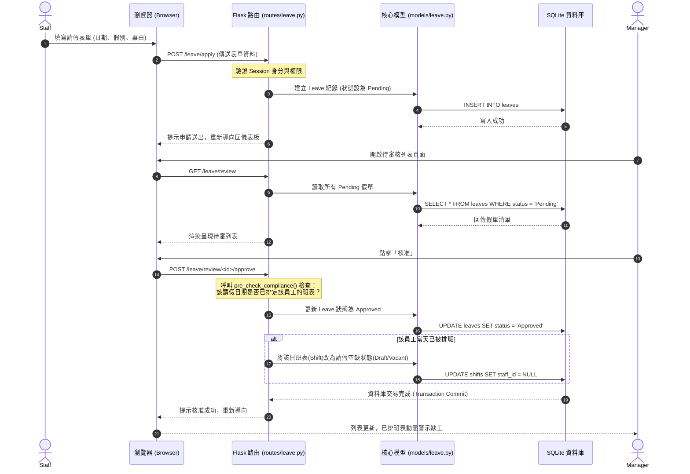
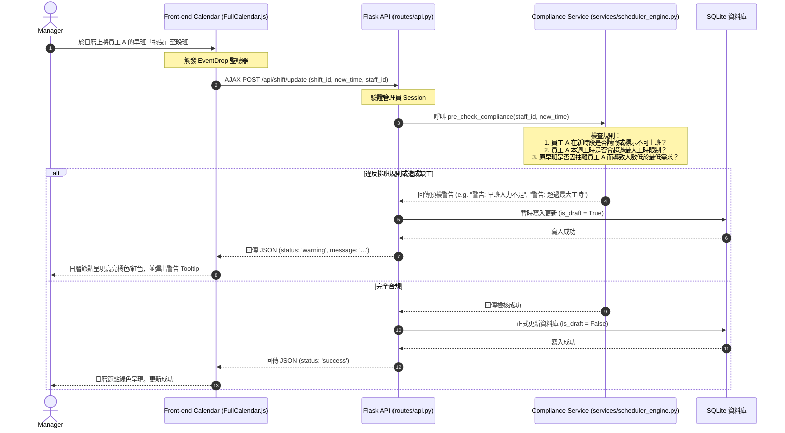

# 自動打工排班最佳化系統 — 系統流程圖設計模板 (FLOWCHART)

本模板依據產品需求模板（PRD）與系統架構設計模板，視覺化呈現本系統的**使用者操作流程（User Flow）**、**系統互動序列（Sequence Diagram）**與**路由功能對照表**，作為前後端程式開發與測試案例設計的藍圖。

---

## 1. 使用者流程圖 (User Flow)

本系統區分為**管理員（店長）**與**一般員工（打工同仁）**兩種角色。以下流程圖描述了使用者從登入系統開始，進行排班、請假與設定偏好時的完整操作路徑。

```mermaid
flowchart TD
    Start([使用者開啟網頁]) --> Login[登入頁面]
    Login --> Auth{身分驗證}
    
    Auth -- 驗證失敗 --> Login
    Auth -- 驗證成功 --> RoleCheck{檢查角色}
    
    %% 管理員 (店長) 路由
    RoleCheck -->|管理員 (店長)| AdminDash[店長儀表板]
    AdminDash --> AdminMenu{選擇操作功能}
    
    AdminMenu -->|員工管理| EmpMgmt[員工列表與最大工時設定]
    EmpMgmt --> EmpEdit[新增/修改員工資料] --> AdminDash
    
    AdminMenu -->|班表與排班控制| ShiftCtrl[排班控制台 Manage Calendar]
    ShiftCtrl --> AutoSchedule[一鍵觸發自動排班]
    AutoSchedule --> DraftView[預覽班表草稿與警示]
    DraftView -->|手動拖拉微調| Tweak[調整特定人員與班別]
    Tweak --> Publish[確認發佈班表] --> AdminDash
    
    AdminMenu -->|請假審核| LeaveReview[待審核假單列表]
    LeaveReview --> ApproveLeave{是否核准請假？}
    ApproveLeave -->|是| SetLeave[變更班表狀態/註記請假]
    ApproveLeave -->|否| RejectLeave[註記拒絕]
    SetLeave & RejectLeave --> AdminDash
    
    %% 一般員工 (Staff) 路由
    RoleCheck -->|一般員工| StaffDash[員工個人儀表板]
    StaffDash --> StaffMenu{選擇操作功能}
    
    StaffMenu -->|填寫排班偏好| PrefSet[排班偏好週曆]
    PrefSet --> SavePref[儲存不可上班與偏好時段] --> StaffDash
    
    StaffMenu -->|請假申請| LeaveApply[請假表單]
    LeaveApply --> SubmitLeave[填寫假別/日期/事由並送出] --> StaffDash
    
    StaffMenu -->|代班發起| SwapShift[個人班表清單]
    SwapShift --> PostSwap[發起代班募集] --> StaffDash
    
    StaffMenu -->|檢視個人與團隊班表| ViewCalendar[行事曆看板 View Calendar]
    ViewCalendar --> ExportICS[匯出個人日曆 .ics] --> StaffDash
```

---

## 2. 系統序列圖 (Sequence Diagram)

為釐清前後端元件的職責，以下設計兩個核心功能的系統資料流序列圖。

### 2.1 員工請假申請與店長審核資料流
本圖展示員工發起請假，到店長審核核准，以及系統如何更新班表的完整時序。



### 2.2 店長手動調整班表與動態缺工預檢
展示當店長在 FullCalendar 行事曆上拖拉或替換排班人員時，前端與後端 AJAX API 的非同步動態預檢機制。



---

## 3. 功能對照與路由對照表

本表列出系統實作時的所有 Flask 路由控制器（Controller）、對應的 URL 路徑、HTTP 方法與功能說明：

| 模組分組 | 路由路徑 (URL Path) | HTTP 方法 | 存取權限 | 功能說明 |
| :--- | :--- | :---: | :---: | :--- |
| **身分驗證** | `/auth/register` | GET / POST | 公開 | 使用者（管理員/員工）註冊頁面與註冊邏輯 |
| | `/auth/login` | GET / POST | 公開 | 使用者登入驗證頁面與邏輯 (寫入 Session) |
| | `/auth/logout` | POST | 登入者 | 登出系統並清除 Session 資訊 |
| **首頁儀表板**| `/` | GET | 登入者 | 根據身分重導向至店長儀表板或員工儀表板 |
| | `/dashboard/manager` | GET | 管理員 | 店長後台看板 (顯示缺工警示、待審假單、今日出勤) |
| | `/dashboard/staff` | GET | 一般員工 | 員工前台看板 (顯示個人本週班表、請假審核狀態) |
| **員工管理** | `/manager/employees` | GET | 管理員 | 檢視所有員工列表、累積工時設定與權限管理 |
| | `/manager/employee/<id>/edit`| GET / POST | 管理員 | 編輯員工最大工時上限、帳戶狀態設定 |
| **排班管理** | `/schedule/view` | GET | 登入者 | 檢視整體班表（月/週/日曆視角，只讀模式） |
| | `/schedule/manage` | GET | 管理員 | 店長排班控制台（提供排班修改、草稿發佈與一鍵排班按鈕） |
| | `/schedule/auto` | POST | 管理員 | 觸發後端智慧排班引擎，生成草稿寫入資料庫 |
| | `/schedule/publish` | POST | 管理員 | 將特定週/月之草稿班表狀態正式轉為「發佈」 |
| **請假與代班**| `/leave/apply` | GET / POST | 一般員工 | 員工申請請假表單填寫與送出 |
| | `/leave/review` | GET | 管理員 | 店長待審核請假名單與歷程頁面 |
| | `/leave/review/<id>/<action>`| POST | 管理員 | 店長審核假單動作 (`action` 為 `approve` 或 `reject`) |
| | `/shift/swap/post` | POST | 一般員工 | 員工針對個人已排定的特定班表，發起線上代班募集 |
| **AJAX API** | `/api/shifts` | GET | 登入者 | 給 FullCalendar 載入特定區間排班資料的 JSON API |
| | `/api/shift/update` | POST | 管理員 | 日曆拖拉排班時，非同步進行變更並執行合規預檢的 API |

---

*模板版本：v1.0*  
*最後更新日期：2026-06-01*
